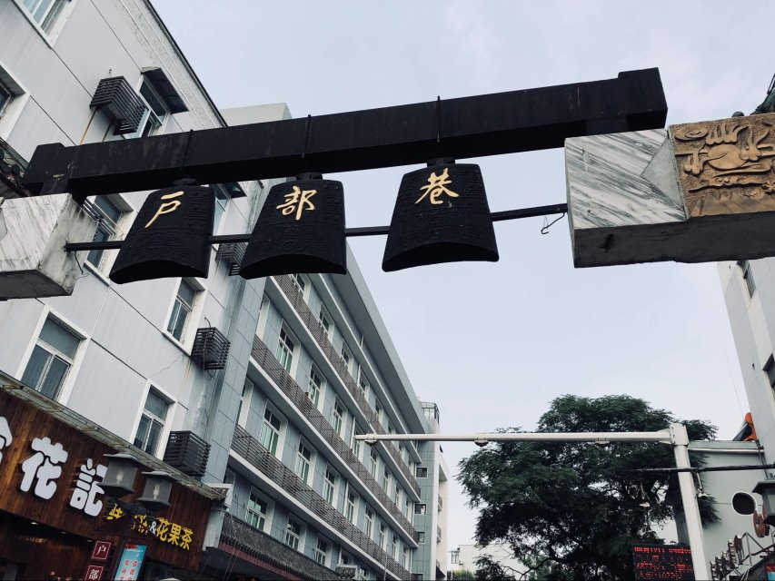
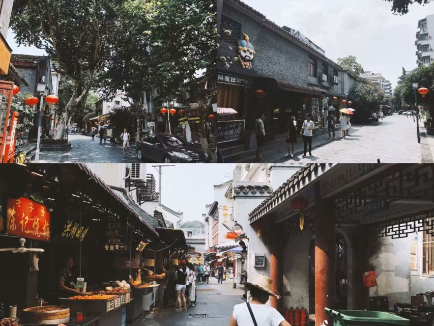
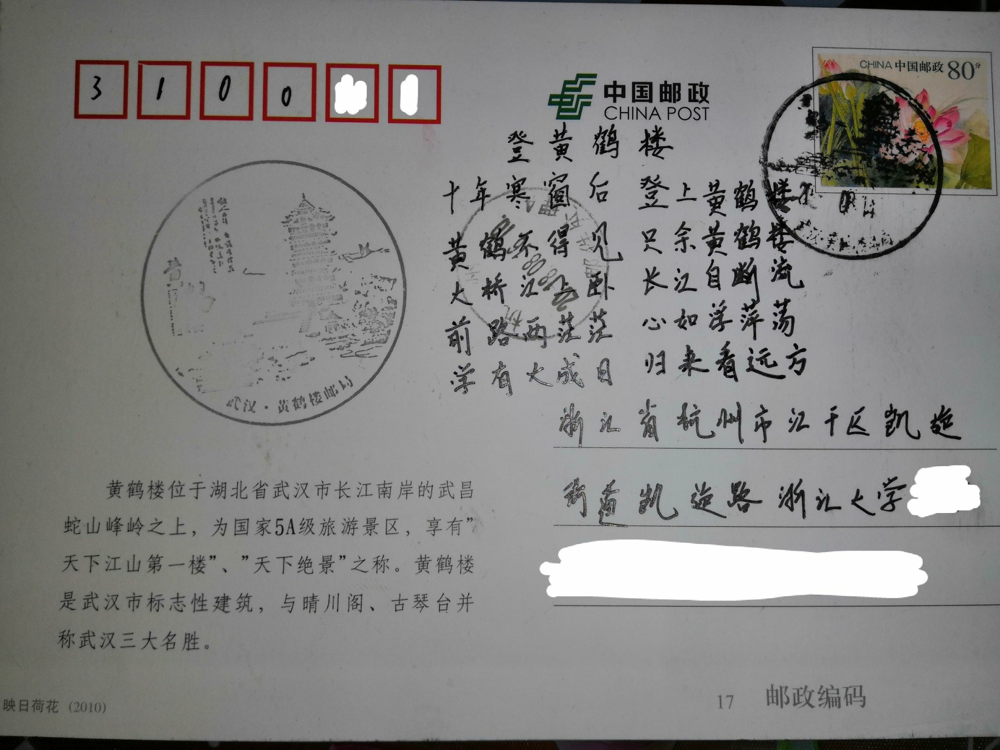
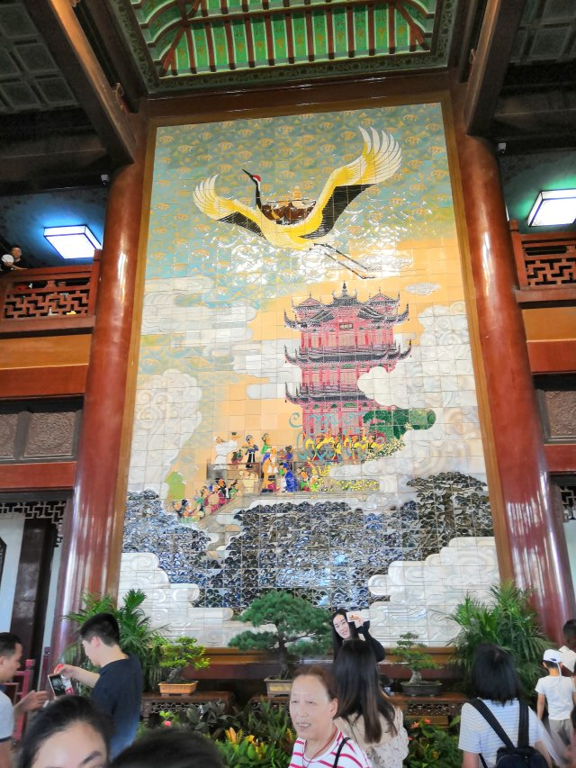
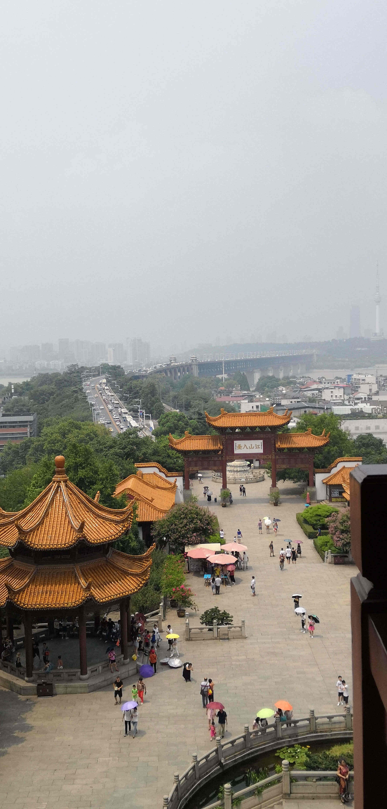
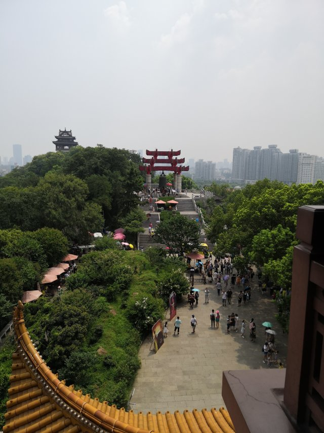

### 这是我的第一篇博客

#### Day 1

早上到的，在机场吃得早餐，去武汉天地逛到下午2点回民宿放行李。然后休息。。。

#### Day 2

当阳光透过窗户，照在我的脸上，新的一天也拉开了序幕，在登高望远之前，我们首先要先填饱肚子，根据攻略，我们来到了位于黄鹤楼边的户部巷，这里据说汇集了武汉各种有名的小吃，即使是早晨，这里也尽显繁华，在前一天，我们已经试了一份热干面和豆皮感受一下当地小吃的性格，感受到得是一种冲，热，如果说昨天是初步了解，那么今天，才是真正碰撞交流，我们除了点了热干面外，还在蔡林记点了煎饺，吃了四季汤包、烧麦......你要是吃货一枚，来这里可就有福了，可大饱一餐，边走边吃（网上说这是武汉人的特色，不要学，我证实，NO ZUO NO DIE!!!）。

吃饱喝足，就开始准备登山了，蛇山黄鹤楼就在户部巷边上，步行差不多一公里左右（虽然我们完整的在蛇山边绕了一圈...），说是爬山，其实没多少路，本人觉得爬山还是登楼更累一些，门票学生证在加美团团购，一张33元，美滋滋。在黄鹤楼下边有一个卖明信片的地方，我和我同学A了一套，可以直接寄回家，突发奇感作诗一首（没学过，押不押韵不知道，大佬就自动忽略哈），如图。

咱们回到主题，继续爬楼（我真得没有推销）。黄鹤楼楼高5层，典型的中国楼阁式建筑，新塔建于1985年（因崔颢所著的那黄鹤楼早已毁于战火），老人可以坐电梯直接上。我当然只能慢慢登楼咯，五层楼各有主题，一二楼中绘有一只黄鹤，二楼主要是卖场（二楼买水特便宜，千万别在外面买！！！）。

三楼开始可以远眺长江，可以看到中国第一座长江大桥——武汉长江大桥。

“一桥飞架南北，天堑变通途”毛主席曾在畅游长江时作此诗词，那是武汉长江大桥全线通车的第一年——1957年。

作为江南三大民楼之一，黄鹤楼名不虚传！！！

既然武汉长江大桥近在眼前了，那怎么能不上去走走。温馨提示：上面不能骑单车。桥上江风阵阵，还是很爽的（夏天注意防晒）。

从长江大桥下来我们去了昙华林，大概距离一公里左右，这个地方是明洪武4年武昌城扩建定型形成的一条老街，保留下来的也是近代的中国传统建筑与西式建筑以及中西结合的建筑为主。现在的昙华林已然成为一个武汉一条安静休闲的小街，主要是茶馆和咖啡馆，知名的鲜花饼店等各式潮流小店林立在街道两旁。在这里你可以任意的吃喝玩乐，享受休闲的午后时光。
