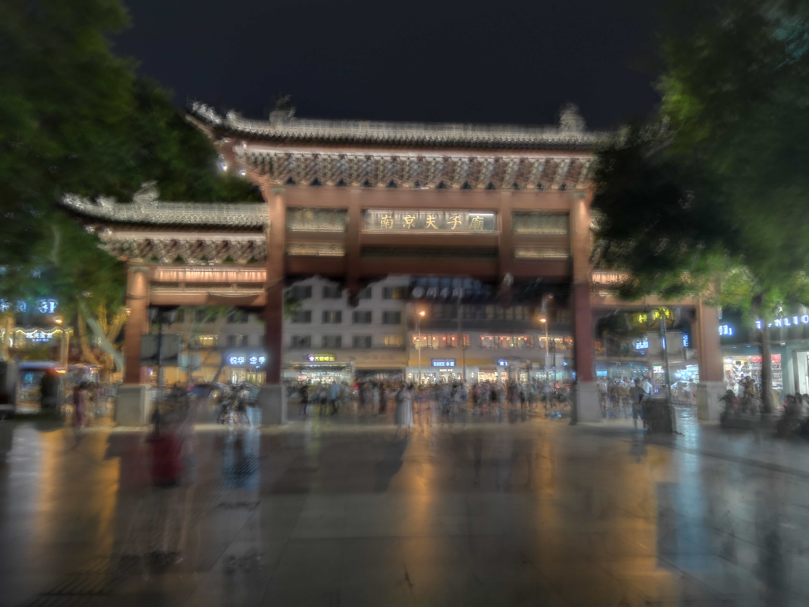
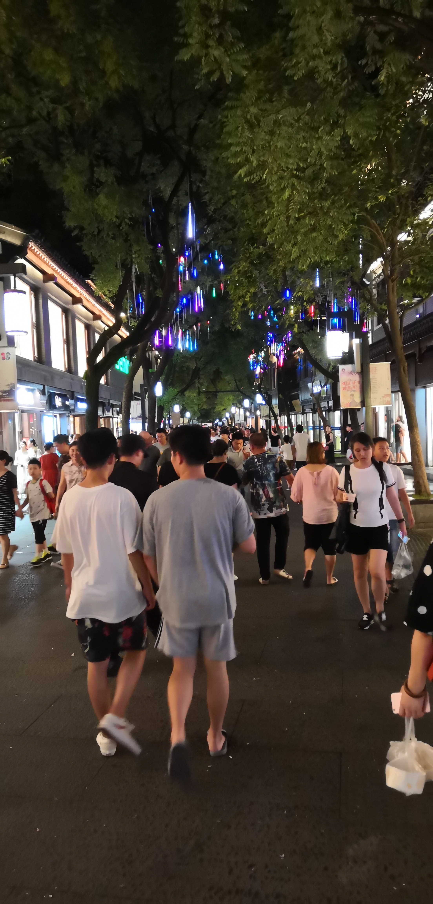
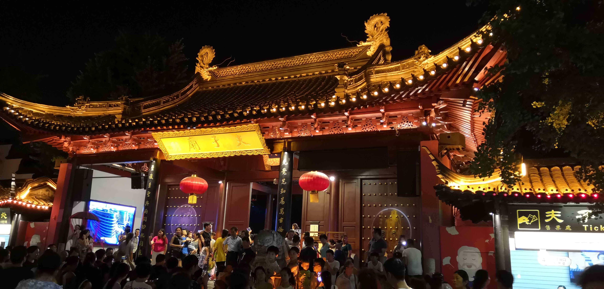

### 漫游南京

#### Day 1
我们到达南京已是中午，因台风原因，南京在我们到了以后开始下起雨来，我们先去民宿放好行李，就打的去味庄先把午饭解决了，主要都是家常菜，质量一般（汤喝不习惯，三个人都没喝），不过分量很足，管饱！！！

吃完饭雨真好停了，我们先买了一大堆零食回民宿，因雨时下时停，所以我们选择呆在民宿了休息T﹏T,晚上，肚子提醒我们不得不解决晚饭问题，我们也想感受一下南京的CBD，于是就去了位于秦淮河夫子庙边上的水平方（我同学第一次说水立方，哈哈），到了水平方，确实很繁华，人和杭州湖滨银泰白天的人相当（来自杭州人民的自豪，晚上别想在湖滨银泰打到的！！），由于下午在民宿里重温了头文字D，所以我们先在三平方的电玩城happy了50块钱，大概玩了将近一个小时，感觉不是很贵。玩完后回归正事，我们的肚子已经在向我们发起抗议了，我们直奔楼上的南京大牌档吃晚饭。这家店真的特别有名,这只是一家连锁店，然后我们拿到号子已经是30开外了，我们足足等了30分钟才排到！

至于这家店的口味如何，我还是点赞的，几年前就来吃过阳春面，现在还是很想回味，而且这里物美价廉（如果你不买什么小龙虾之类的），小吃品种丰富，美龄粥的味道也是格外的好，至于盐水鸭我本人不是很喜欢吃，但味道应该是还不错的，我的同学都觉得很赞哦！我们三个人吃了143元，是点多了，吃得很撑，名菜就一个鱼没点，这里建议大家早点去，因为去晚了可能很多名小吃都售罄了哦。

既然秦淮河夫子庙就在边上，哪有不去逛逛的道理，上次来的时候来去匆匆，而且是白天，都没有好好看。这次一定要满足上次的遗憾，现在秦淮河边商业繁华，做工也很精致，有那种古代十五元宵赏灯的那种韵味。

不过我们并没有买东西，原因大家懂得。遗憾的是这次我们来到太晚了，没有去秦淮河上坐船赏湖，不过我们民宿也近，过两天再来！

游玩秦淮河，时间已经很晚了，我们也没有多逛，直接打的回民宿休息，毕竟人懒哈哈（到南京旅游滴滴打车有送券哦，前两次打能便宜好多！），第一天也就此结束。
